<div align="center">
    <h1>Cloud Computing Basic Report</h1>
    <h3>Author: Christian Faccio</h3>
    <h5>Email: christianfaccio@outlook.it</h4>
    <h5>Github: <a href="https://github.com/christianfaccio" target="_blank">christianfaccio</a></h5>
</div>

---


## Table of Contents
- [Requirements](#requirements)
- [VM Cluster](#vmcluster)
- [Container Cluster](#containercluster)

The instructions below allowed me to create a cluster of VM and of containers. For the Virtual Machines I have used VirtualBox and for the containers Docker, but the general concepts can be applied to other virtualization software with the right changes. 

Important things:
- I have used MacOS as the host operating system
- The VMs are running Ubuntu 20.04
- The VM cluster comprises one master node and two working nodes
- Only the master node VM is connected to the internet through a NAT connection
- Working nodes are connected to the master node via Internal Network

## Requirements

1. Download [VirtualBox](https://www.virtualbox.org/wiki/Downloads)
2. Download [Ubuntu 20.04](https://ubuntu.com/download/desktop)

---

## VM Cluster

### Specifications


|  |Master Node | Working Node 1 | Working Node 2 |
|----------|----------|----------|----------|
| vCPU | 2 | 2 | 2 |
| RAM | 2048MB | 2048MB | 2048MB|
| SSD | 25GB | 25GB | 25GB |


### Configuring the template VM

1. Create a machine and name it **template**
2. Choose a location (usually, leave it as default)
3. Load the ISO image
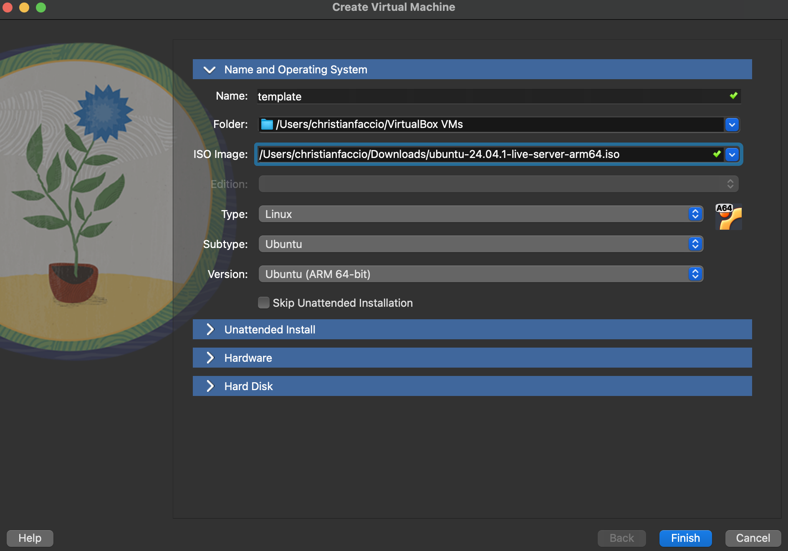
4. Change username and password if you want, but remember them for the next steps
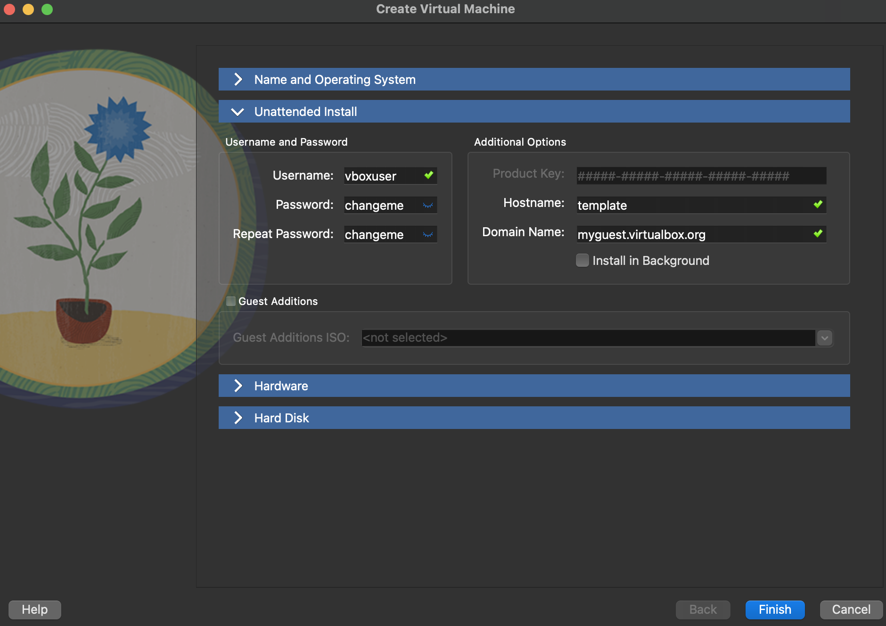
5. Assign the resources as specified in the requirements
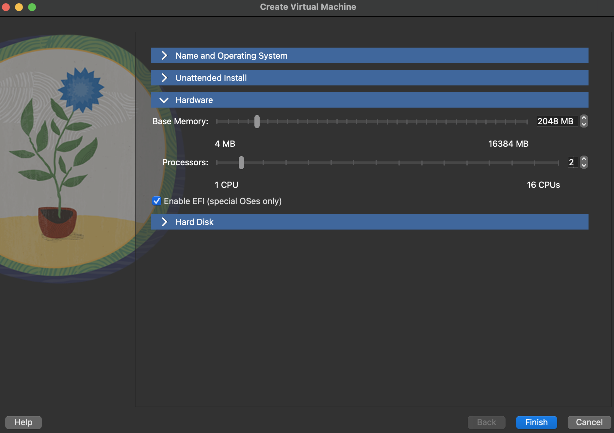
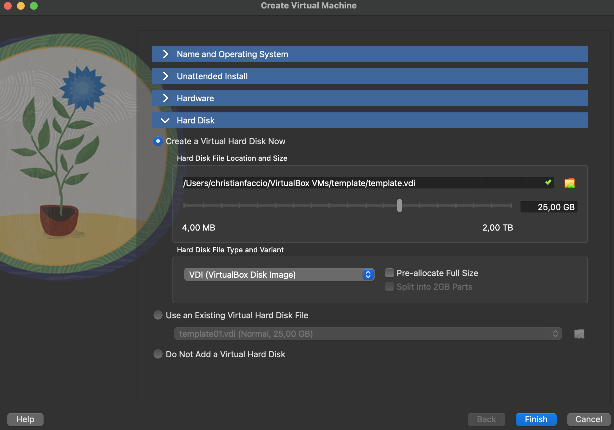
6. Finish the setup and start the machine
7. Once started and logged in, update the system
```bash
sudo apt update
sudo apt upgrade
```
and try to ping any public site (e.g. google.com or 8.8.8.8) to check the internet connection
```bash
ping google.com
ping 8.8.8.8
```
> ⚠️ **Warning**: DNS
>It could happen that pinging a domain name does not work. In >this case, check the
>DNS settings:
>```bash
>cat /etc/resolv.conf
>```
>If it is empty or does not contain a valid nameserver, add >one:
>```bash
>echo "nameserver 8.8.8.8" | sudo tee /etc/resolv.conf
>```
>Now you can try again to ping a domain name and it should >work.
**Remember that the VM by default uses the American keyboard layout.**

You can also check the DHCP-assigned IP address by entering one of the following commands:
```bash
hostname -I #returns the IP address of the machine
ip a #returns the IP address and the network interface
ip route show #returns the routing table
```

This is the default IP address assigned by your network DHCP. Note that this IP address is
dynamic and can change or worst still, get assigned to another machine. But for now, you
can connect to this IP from your host machine via SSH.
Now install some useful additional packages:

```bash
sudo apt install net-tools
sudo apt install gcc make
```

If everything is ok, we can proceed cloning this template. You must shutdown the node to
clone it, using VirtualBox interface (select VM and right click) create 2 new VMs.

```bash
sudo shutdown -h now
```

Configure the VirtualBox internal network: open Tools→Network Manager and create a
new one named CloudBasicNet
```bash
Mask: 255.255.255.0
Lower Bound: 192.168.56.2
Upper Bound: 192.168.56.199
```
**.1** is typically reserved for the gateway, the rest of the range (from .2 to .199 ) is allocated to virtual machines (VMs) dynamically by the DHCP server. This setup ensures controlled
IP allocation within **192.168.56.2 - 192.168.56.199** , avoiding conflicts with the host
or other network elements.

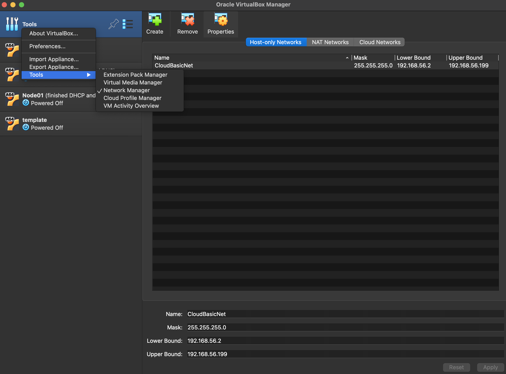

## Master Node

It is time now to create the first clone, the Master Node. To do so, right click on the template VM
and select Clone. Name it **master** and proceed with the cloning.

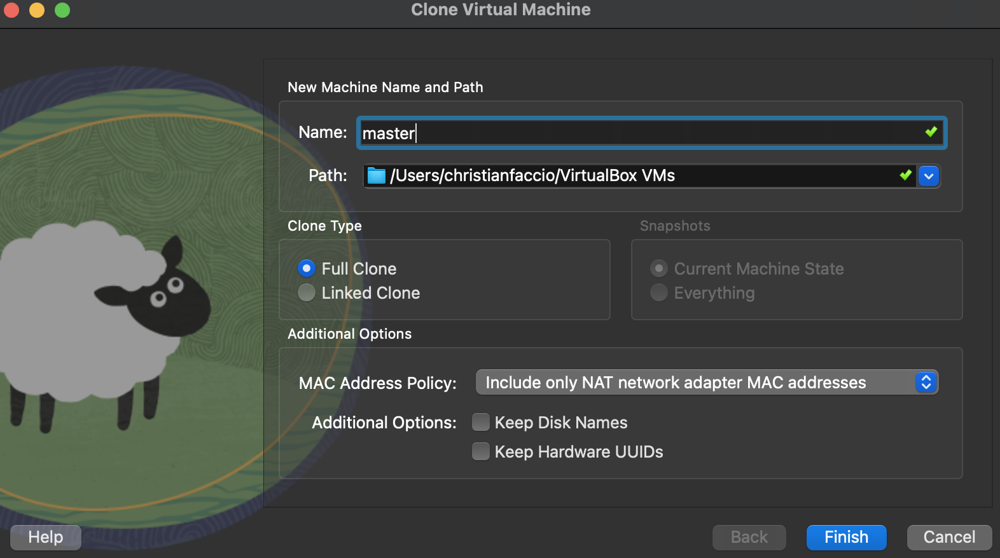

Before starting the master node VM, we need to configure the network settings and the port forwarding for ssh connection.

### Initial Settings
- First things first, and since the hostname is still the same as the template, we need to change it. Edit
the file **/etc/hostname** and replace the current hostname with the new one. Save and exit.
```bash
sudo vim /etc/hostname # Replace the current hostname with the new one (master)
```
Restart the master node VM to apply the changes:
```bash
sudo shutdown -h now
```
- Go to the network settings of the master node and enable the Adapter 2, setting it as Internal
Network and CloudBasicNet. This will allow the master node to communicate with the working
nodes.
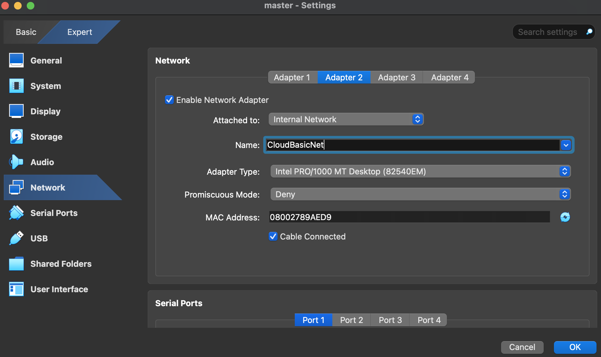
- Go now to the port forwarding settings in the Adapter 1 and add a new rule for SSH connection. For the host port, any available port on your host machine can be used, as long as it is not already in use by another process. The guest port is typically the default SSH port inside the guest VM (or container), usually port 22, unless you’ve configured the guest OS to use a different port.
This will allow you to connect to the master node via SSH.
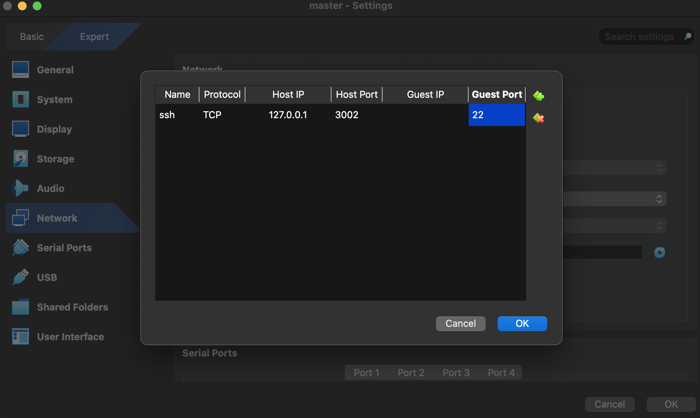

Save the settings and start the master node VM.

### SSH connection

You can bootstrap the VM and ssh from a terminal of your Host Machine (if you like).
On the master node, install the openssh-server package:
```bash
sudo apt install openssh-server -y
```
And check its status, if it is not running, start it:
```bash
sudo systemctl status ssh
sudo systemctl enable ssh
```
Now on your host machine, you can connect to the master node via SSH:
```bash
ssh -p 3002 <username>@127.0.0.1
```
> **Warning**: an error message like the one below could appear in this phase:
>```bash
>ssh -p 3002 christianvm@127.0.0.1
>@@@@@@@@@@@@@@@@@@@@@@@@@@@@@@@@@@@@@@@@@@@@@@@@@@@@@@@@@@@
>@    WARNING: REMOTE HOST IDENTIFICATION HAS CHANGED!     @
>@@@@@@@@@@@@@@@@@@@@@@@@@@@@@@@@@@@@@@@@@@@@@@@@@@@@@@@@@@@
> ...

If you want to avoid typing the password every time you connect via SSH, you can set up a
passwordless SSH connection. To do so, generate a new SSH key pair on your host machine:
```bash
ssh-keygen -t rsa # Press Enter to save the key in the default location
````

Copy the public key to the master node:
```bash
ssh-copy-id -p 3002 <username>@127.0.0.1
```
Now you can connect to the master node without typing the password.

### Network Configuration

Let’s now check the network settings. The master node should have two network interfaces: one
connected to the internet (NAT) and the other connected to the internal network.
```bash
ip link show

1: lo: <LOOPBACK,UP,LOWER_UP> mtu 65536 qdisc noqueue state UNKNOWN mode
DEFAULT group default qlen 1000
link/loopback 00:00:00:00:00:00 brd 00:00:00:00:00:00
2: enp0s8: <BROADCAST,MULTICAST,UP,LOWER_UP> mtu 1500 qdisc fq_codel
state UP mode DEFAULT group default qlen 1000
link/ether 08:00:27:3b:6d:34 brd ff:ff:ff:ff:ff:ff
3: enp0s9: <BROADCAST,MULTICAST> mtu 1500 qdisc noop state DOWN mode
DEFAULT group default qlen 1000
link/ether 08:00:27:89:ae:d9 brd ff:ff:ff:ff:ff:ff
```
 
If you look closely, you will see that the interface **enp0s8** is connected to the internet (NAT)
and the interface **enp0s9** is connected to the internal network, but the VM does not have an IP
address assigned to it. Now we will configure the adapter, i.e. assign an IP address to the interface
**enp0s9** . It will be the master node so it will act as a gateway for the working nodes and will have
IP **192.168.0.1**.

```bash
sudo vim /etc/netplan/50-cloud-init.yaml

network:
    ethernets:
        enp0s8:
            dhcp4: true
        enp0s9:
            dhcp4: false
            addresses: [192.168.0.1/24]
    version: 2
```

Apply the changes with the following command:

```bash
sudo netplan apply
```

> **Observation**: Master Node IP
The master node has a static IP on the internal network since it will act as a gateway for the
working nodes. The working nodes will have dynamic IPs assigned by the DHCP server
running on the master node.

Edit the hosts file to assign names to the cluster that should include names for each node as follows:
```bash
sudo vim /etc/hosts

127.0.0.1 localhost
192.168.0.1 master

# The following lines are desirable for IPv6 capable hosts
::1 ip6-localhost ip6-loopback
fe00::0 ip6-localnet
ff00::0 ip6-mcastprefix
ff02::1 ip6-allnodes
ff02::2 ip6-allrouters
```

We do not specify a static IP for the working nodes since we will later set up a DHCP server on the
master node to assign IPs dynamically to the working nodes.


## Working Nodes

Now redo the same process for the two working nodes.

Open VirtualBox and clone the above create **template**, creating **node1** and **node2**.

Go on the settings of each working node, on the Network tab, and select Internal Network for Adapter1, name it as the one of the master node (ClusterVimNet in this case). 

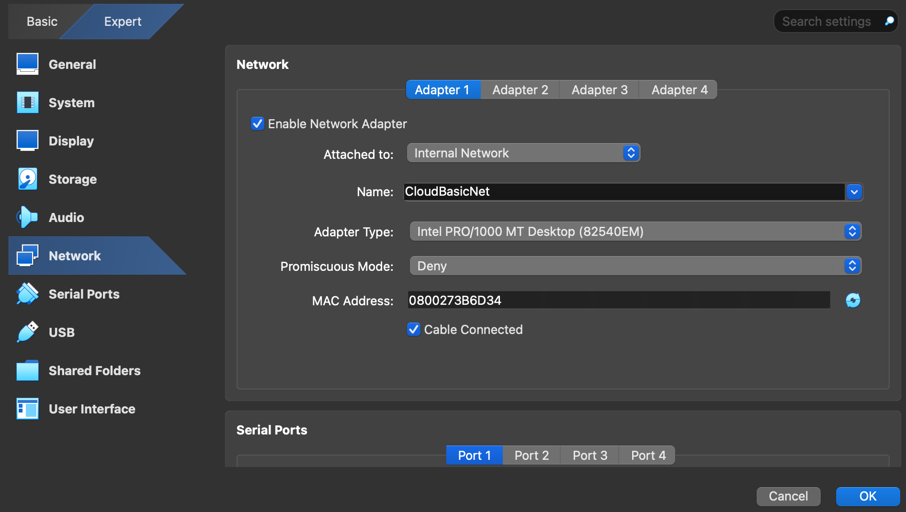

Click "ok" and start the VMs.

For each VM, change the hostname and the hosts file:
```bash
sudo vim /etc/hostname #change the name and insert the right one for each VM (the one you setted in VirtualBox)
```
```bash 
sudo vim /etc/hosts

127.0.0.1 localhost
192.168.0.1 master

# The following lines are desirable for IPv6 capable hosts
::1 ip6-localhost ip6-loopback
fe00::0 ip6-localnet
ff00::0 ip6-mcastprefix
ff02::1 ip6-allnodes
ff02::2 ip6-allrouters
```

Restart the VMs to apply the changes.

## DHCP and DNS configuration

To configure DHCP on your master node, you can use a tool like dnsmasq or isc-dhcp-server. Since
you’re setting up a network and assigning IPs dynamically, let’s go through the configuration steps
using dnsmasq, which is lightweight and commonly used for DHCP and DNS management.

Here are the steps to set up DHCP on the master node:
1. Start the **master** node VM, log in, and install dnsmasq:
```bash 
sudo apt update
sudo apt install dnsmasq -y
```
2. Configure dnsmasq: Edit the configuration file **/etc/dnsmasq.conf**:
```bash 
sudo vim /etc/dnsmasq.conf
```
Add the following lines to the configuration file:
```bash 
# Specify the internal network interface (change if needed)
interface=enp0s9s  # Use the correct internal interface (check with `ip a`)

# DHCP range (adjust as needed)
dhcp-range=192.168.0.100,192.168.0.200,12h  # Assign IPs in this range for 12 hours

# Set the gateway (the master node itself)
dhcp-option=3,192.168.0.1  

# Set the DNS server (the master node itself)
dhcp-option=6,192.168.0.1  

# Local DNS resolution
local=/cluster.local/
expand-hosts
domain=cluster.local
```

Replace **enp0s9** with the name of the internal network interface.

3. Ensure the master node has a static IP on its internal network interface (**enp0s9**):
```bash 
sudo vim /etc/network/interfaces

auto enp0s9
iface enp0s9 inet static
address 192.168.1.1
netmask 255.255.255.0
```

Restart the dnsmasq service to apply the changes:
```bash
sudo systemctl restart dnsmasq
sudo systemctl enable dnsmasq
```

4. Ensure IP Forwarding is Enabled
Edit `/etc/sysctl.conf`
```bash
net.ipv4.ip_forward=1 #uncomment this line
```

Apply changes:
```bash
sudo sysctl -p
```

Now the working node should now have an IP address assigned by the DHCP server running on
the master node. 

5. Test connection pinging the master node
```bash
ping 192.168.0.1
```

### Master node as Gateway

To let the working node connect to the internet, you have to setup the master node as the default gateway. 
Enable NAT on the Master Node. Assuming your master node has two interfaces:
- **enp0s8** connected to the internet (NAT)
- **enp0s9** connected to the internal network
Run the following command:
```bash
sudo iptables -t nat -A POSTROUTING -o enp0s8 -j MASQUERADE
sudo iptables -A FORWARD -i eth1 -o eth0 -j ACCEPT
sudo iptables -A FORWARD -i eth0 -o eth1 -m state --state RELATED,ESTABLISHED -j ACCEPT
```
Replace enp0s8 with the name of the interface connected to the internet.
To persist the rules:
```bash
sudo apt-get install iptables-persistent # For Debian/Ubuntu
sudo netfilter-persistent save
sudo netfilter-persistent reload
```
Configure the Woring Node to Use the Master Node as a Gateway. On the working node, set
the master node as the default gateway:
```bash
sudo ip route add default via <MASTER\_NODE\_IP>
```

You are now connected to the Internet, try to ping:
```bash
ping 8.8.8.8
```

> **Warning**: DNS is not configured yet, so pinging google.com as an example will not work

To add DNS resolution, modify the `/etc/netplan/50-cloud-init.yaml`file in the working node, this way:
```bash
network:
    ethernets:
        enp0s8:
            dhcp4: true
            dhcp-identifier: mac
            nameservers:
                addresses: [192.168.0.1, 8.8.8.8, 8.8.4.4]
    version: 2
```
Try to ping a domain name:
```bash
ping google.com
```

### SSH on working node

Install SSH server in the working node:
```bash
sudo apt update
sudo apt install openssh-server -y
```

Start and enable SSH server:
```bash 
sudo systemctl enable ssh
sudo systemctl status ssh
```

Now you can ssh into the working node from the master node:
```bash
ssh <username>@<working\_node\_IP>
```
To know the working node IP, since it is assigned dynamically, you can check it with the following
command in the working node:
```bash 
hostname -I
```

>**Tip:** to have a passwordless access via ssh, generate a new SSH key pair on your master node:
>```bash 
>ssh-keygen -t rsa -b 4096 # Press Enter to save the key in the default location
>```
>Copy the public key to the working node
>```bash 
>ssh-copy-id user@<working_node_IP>
>``` 
>Set the correct permissions on the working node
>```bash 
>chmod 700 ~/.ssh
>chmod 600 ~/.ssh/authorized_keys
>````
>Test ssh connection
>```bash
>ssh user@<working_node_IP>
>```

Now just clone this working node to create as many other nodes as you want, change their hostname and you are set up. Remember to check if they have the same IP assigned.

## Distributed Filesystem

NFS is one of the most commonly used distributed file systems for sharing files across multiple
nodes in a network.
1. Install the NFS server package on the master node:
```bash 
sudo apt install nfs-kernel-server
``` 

2. Create a directory to share:
```bash 
sudo mkdir /shared
sudo chmod 777 /mnt/shared
``` 
3. Configure the NFS server: Edit the file `/etc/exports`:
```bash 
sudo vim /etc/exports
``` 
and add the following line in the file:
```bash 
/shared 192.168.0.0/24(rw,sync,no_subtree_check) #This allows all nodes in the 192.168.0.0 network to access the shared folder.
``` 
Replace `<working_node_IP>` with the IP address of the working node.
4. Export the shared directory:
```bash 
sudo exportfs -a
``` 
5. Restart the NFS server to apply the changes:
```bash
sudo systemctl restart nfs-kernel-server
sudo systemctl enable nfs-kernel-server
```
6. Install the NFS client package on the working node:
```bash 
sudo apt install nfs-common
```
7. Create a directory to mount the shared directory:
```bash 
sudo mkdir /shared
```
8. Mount the shared directory on the working node:
```bash 
sudo mount <master\_node\_IP>:/shared /shared

df -h
...
192.168.0.1:/shared 24G 2.8G 20G 13% /shared #you should see this line
```
Replace `<master_node_IP>` with the IP address of the master node.

Try now to create a file in the `/shared` folder in the master node:
```bash 
touch /shared/test.txt
```

You should see this file in the working nodes:
```bash 
ls /shared
```

9. Make the mount permanent. In the working nodes, edit the `/etc/fstab` file adding the following line:
```bash 
192.168.0.1:/mnt/shared /mnt/shared nfs defaults 0 0
```
Save and exit, then run:
```bash 
sudo mount -a
```

---

## Measuring Performances

#### HPCC

1. Install HPCC on every node
```bash
sudo apt update
sudo apt install -y hpcc
```

2. Install OpenMPI on every node:
```bash 
sudo apt install -y openmpi-bin libopenmpi-dev
```

>**Warning**: ensure there is a passwordless ssh connection between master and working nodes

3. On the master node, generate the HPCC configuration file:
```bash 
vim hpccinf.txt
```
Modify:
- **Processor Count**: Set the total number of CPU cores in the cluster.
- **Memory Size**: Adjust based on available RAM.
- **MPI Settings**: Ensure correct paths.

Check https://www.advancedclustering.com/act_kb/tune-hpl-dat-file/ to use the right parameters for your cluster.

Create the Hosts File on the Master Node:
```bash 
vim hosts
```

and add the following lines:
```bash
<worker_node_1_IP> slots=<n_cores_worker_1>
<worker_node_2_IP> slots=<n_cores_worker_2>
```

4. Run HPCC with the correct path:
```bash 
mpirun -np 4 -hostfile hosts hpcc
```
This will run the HPCC tests on the working nodes. To see results open the `hpccoutf.txt` file. 

>**WARNING**: SSH connection MUST be passwordless between all the nodes, otherwise you will get an error

>**TIP**: The files `hosts` and `hpccinf.txt` created before can be put in the distributed system between all the nodes, this way it is simpler to give the right permissions to the nodes to read the files. 

Below are the performance values for the 13 tests of the HPCC suite.

| Test | Value | Comment |
|----------|----------|----------|
| MPI Random Access (GUP/s)   | 0.0033   | The random memory access speed is very low (only 0.00334 GUP/s), indicating that the system's memory bandwidth and latency are major bottlenecks. |
| Star Random Access (GUP/s)   | 0.0687   | StarRandomAccess is ~20x faster (0.0687 GUP/s vs. 0.00334 GUP/s). This suggests that memory access patterns in StarRandomAccess are more cache-friendly, while MPIRandomAccess suffers from higher memory latency.|
| Single Random Access (GUP/s) | 0.0921 | Higher GUP/s than StarRandomAccess (0.0687 GUP/s) and MPIRandomAccess (0.00334 GUP/s). Since only one node was tested, the memory contention across multiple nodes didn't affect performance. |
| PTRANS (GB/s) | Wall: 0.550, CPU: 4.273 | Wall-time bandwidth (0.550 GB/s) is much lower than CPU bandwidth (up to 4.273 GB/s), suggesting MPI communication overhead is a bottleneck and memory access patterns might be inefficient across nodes. |
| StarDGEMM (avg. GFLOP/s) | 2.909 | Stable performance across runs (only a small difference between min/max GFLOP/s). No numerical errors, meaning the computation is accurate. Performance is limited (DGEMM is usually memory-bandwidth bound on small clusters).|
| SingleDGEMM (GFLOP/s) | 4.34 | SingleDGEMM (4.34 GFLOP/s) is ~49% faster than StarDGEMM (2.91 GFLOP/s avg). Better performance in single-node test suggests that multi-node communication overhead or memory bottlenecks are affecting StarDGEMM. |
| StarSTREAM Copy (GB/s) | 23.20 | Best, average, and worst times for each operation are consistent, indicating stable performance across multiple tests. Copy operation has the highest bandwidth (23.20 GB/s), which is expected as it is the simplest operation and often reveals the system’s raw memory bandwidth. The system is performing well for these memory-bound operations, and the performance is stable with no errors detected.
| SingleSTREAM Copy (GB/s) | 41.50 | Single-node performance is significantly better than the multi-node performance from the StarSTREAM test. Copy performance is 41.50 GB/s on Node 2, much higher than the 23.20 GB/s from StarSTREAM across multiple nodes. |
| MPIFFT (Gflop/s) | 2.133 | The Gflop/s rate (2.133 Gflop/s) is relatively low for an FFT, suggesting that memory bandwidth or computational overhead is limiting the performance. Very small error (1.894e-15) indicates high accuracy, meaning the results are highly reliable. |
| StarFFT (Gflop/s) | 3.44 | The StarFFT performance is better compared to the MPIFFT test with a higher Gflop/s rate (average 3.44 Gflop/s). This suggests that multi-node communication or load balancing may be improving efficiency. The error is negligible (2.061e-15), indicating that the test passed with high accuracy. |
| SingleFFT (Gflop/s) | 4.07 | 4.07 Gflop/s is a solid result for a single node, showing efficient performance for FFT calculations on Node 1. No errors detected, indicating high accuracy and correctness. |
| Min-Max Latency (ms) | 0.000628-0.166512 | The benchmark demonstrates very low latency for communication, especially for small messages, as indicated by the min latency (0.000628 ms). |
| Min-Max Ping Pong Bandwidth (MB/s) | 194.301-27467.623 | The bandwidth with smaller messages (like 8 bytes) is limited, but the system still maintains a relatively low latency, indicating good responsiveness for small data transfers. For larger message sizes (2MB), the system provides strong bandwidth performance, particularly with naturally ordered communication. |
| HPL (Gflop/s) | 10.64 | The system performed very well in the HPL benchmark, with both good performance and accuracy, confirming its strength in solving large-scale linear systems. |


---
#### Network test (Iperf3)

| Test Scenario            | Direction         | Transfer (GBytes) | Bitrate (Gbits/sec) | Retransmissions (Retr) | Remarks                             |
|--------------------------|-------------------|-------------------|---------------------|------------------------|-------------------------------------|
| **Master01 - Node01**     | Forward           | 3.46 GBytes       | 2.97 Gbits/sec      | 887                    | Consistent throughput, moderate retransmissions |
| **Master01 - Node01**     | Reverse           | 3.71 GBytes       | 3.18 Gbits/sec      | 744                    | Slightly better performance in reverse direction |
| **Node01 - Node02**       | Forward           | 3.45 GBytes       | 2.96 Gbits/sec      | 270                    | Slightly lower performance, fewer retransmissions |
| **Node01 - Node02**       | Reverse           | 3.31 GBytes       | 2.84 Gbits/sec      | 45                     | Stable performance with minimal retransmissions |

Key Observations:
- The network throughput ranged between **2.84 Gbits/sec** and **3.18 Gbits/sec** across the various test directions, showing a high-performance network.
- **Retransmissions** were moderate, with **Master01 - Node01** showing the highest count, which suggests some potential for packet loss or network congestion in the forward direction.
- The reverse direction tests generally performed better in terms of throughput, indicating that the reverse path might be less congested or optimized.
- **Node01 - Node02** had fewer retransmissions, suggesting better stability, even though the throughput was slightly lower than the other tests.

Conclusion:
Overall, the network between the nodes is performing well with high throughput. However, there are some fluctuations in performance, likely caused by network conditions such as congestion, load, or routing differences, which are most noticeable in the forward direction from **Master01 to Node01**. 

The results suggest that while the network is fast, there may be occasional packet loss or congestion that can be improved for optimal performance.

---

#### Stress-ng Test Results

Test Configuration:
- **Stress-ng Version**: 0.17.06
- **Test Duration**: 60 seconds per stressor
- **Test Command**: `stress-ng --cpu 2 --timeout 60s --verbose`
- **System Information**:
  - **OS**: Ubuntu 6.8.0-55-generic
  - **Kernel**: 6.8.0-55-generic
  - **CPU**: 2 processors (Online: 2, Configured: 2)
  - **RAM**: 1.9 GB (Free: 1.1 GB)
  - **Filesystem Type**: ext2 (Master), nfs (Node01, Node02)

Nodes Tested:
1. **Master Node** (master01)
2. **Node 1** (node01)
3. **Node 2** (node02)

Test Results:

| Node         | Direction       | Stressors Started | Stressors Exited | Time Taken   | Metrics Check |
|--------------|-----------------|-------------------|------------------|--------------|---------------|
| **Master01** | CPU Stress Test | 2                 | 2                | 1 min, 0.08s  | Passed (2 CPU)|
| **Node01**   | CPU Stress Test | 2                 | 2                | 1 min, 0.04s  | Passed (2 CPU)|
| **Node02**   | CPU Stress Test | 2                 | 2                | 1 min, 0.07s  | Passed (2 CPU)|

Key Observations:
- All three nodes ran the stress tests for **60 seconds** with 2 CPU stressors each.
- **All tests passed successfully** without any failures.
- **Metrics** for the stressors were validated as sane for all nodes.
- The performance was **stable across nodes**, with minor variations in test completion times (between **1 min, 0.04s** and **1 min, 0.08s**).
- The **RAM** usage was observed as sufficient (1.9GB total, with 1.1GB free) across all nodes during the tests.

Conclusion:
The stress tests on all nodes (Master, Node01, and Node02) were successfully completed with no failures. The system showed good stability and performance under CPU stress for the given time. No issues with resource availability or system crashes were noted, making the system robust under load.


---

#### Disk I/O test (IOZone)

```bash
iozone -a -i 0 -i 1 -i 2 -f ./testfile > iozone_distrsys_output.txt
```

**Purpose**: Evaluates disk I/O performance using `iozone`.

- `-a`: This option tells iozone to perform a set of automatic tests (all tests for performance).
- `-i 0 -i 1 -i 2`: These options specify the types of tests to run:
    - `-i 0`: Sequential write test
    - `-i 1`: Sequential read test
    - `-i 2`: Random read/write test
- `-f ./testfile`: Specifies the file (`testfile`) to be used for testing, located in the current directory (which in your case would be the shared directory).
- `iozone_distrsys_output.txt`: Redirects the output of the test to a file (`iozone_distrsys_output.txt`).

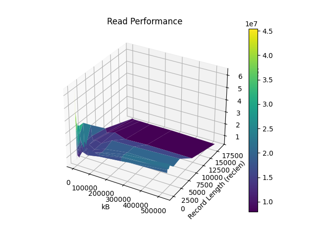
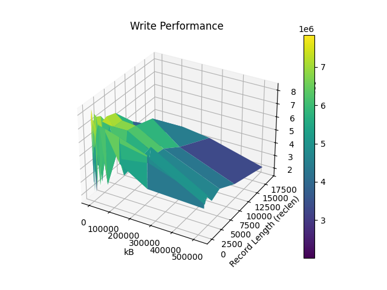
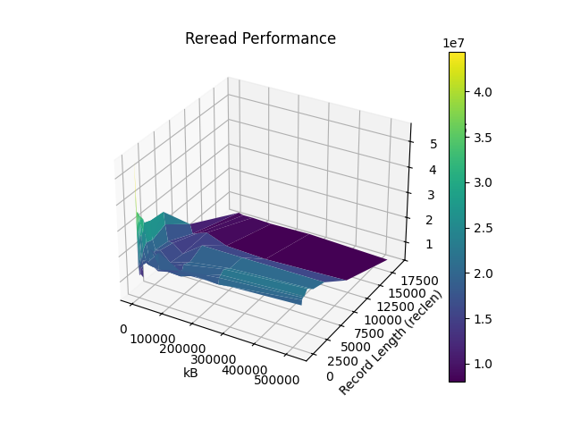
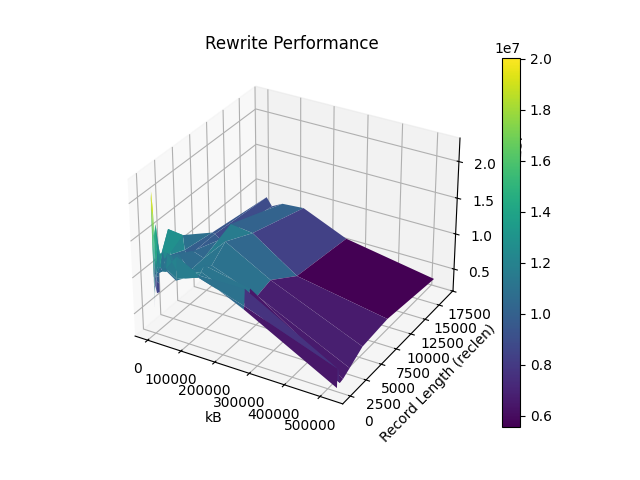
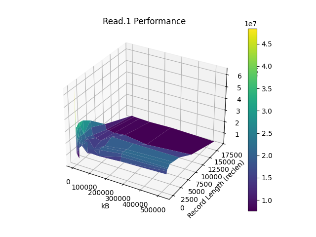
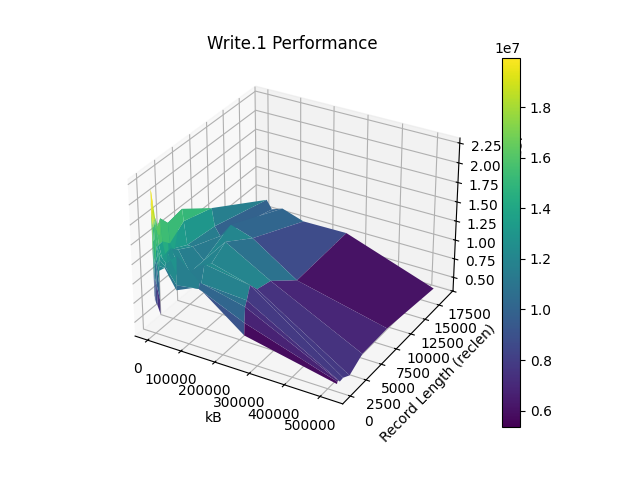


