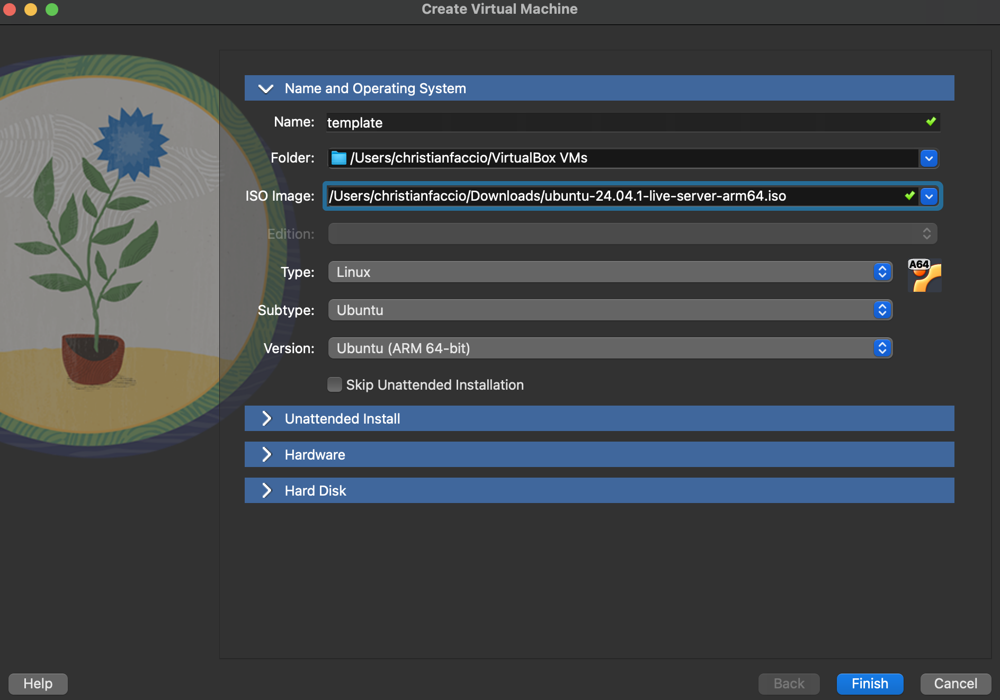
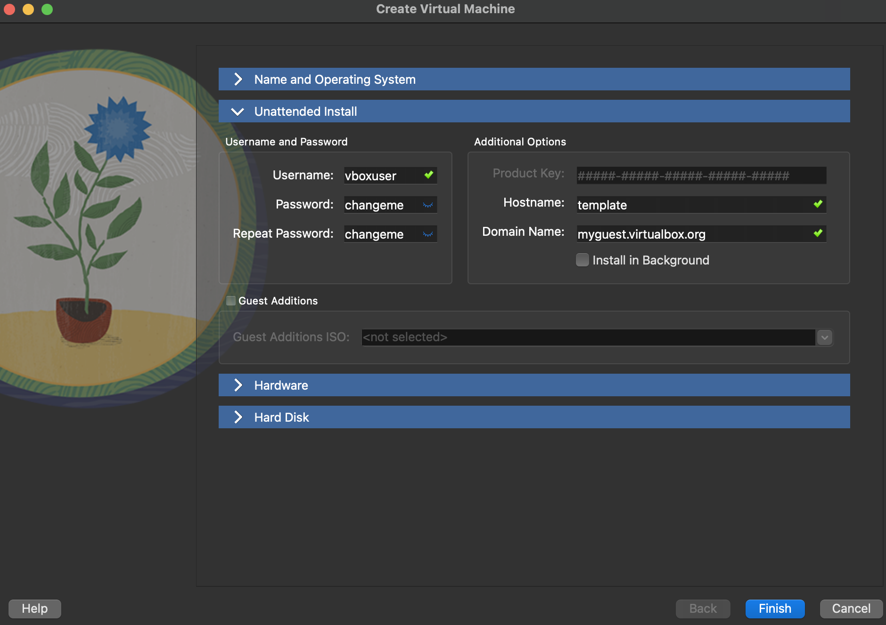
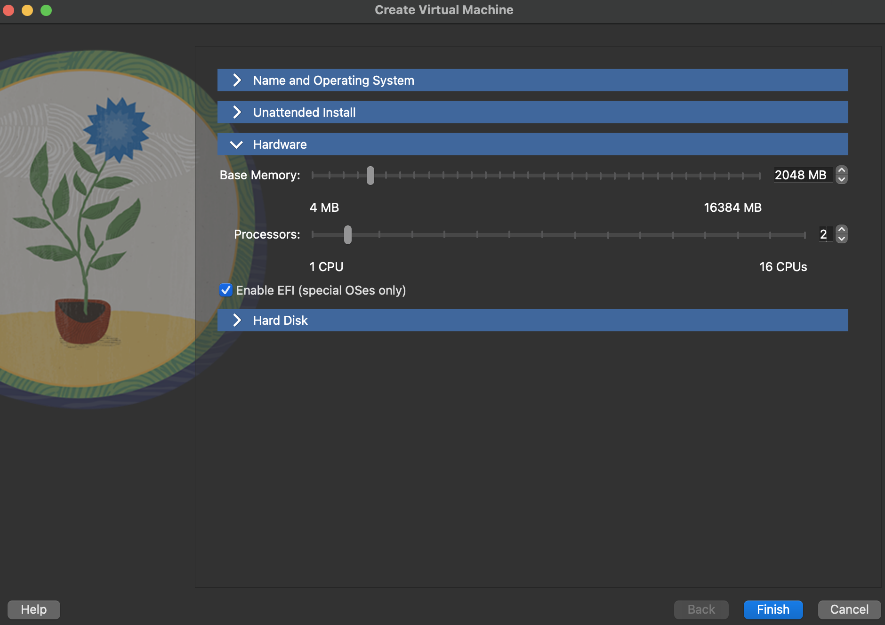
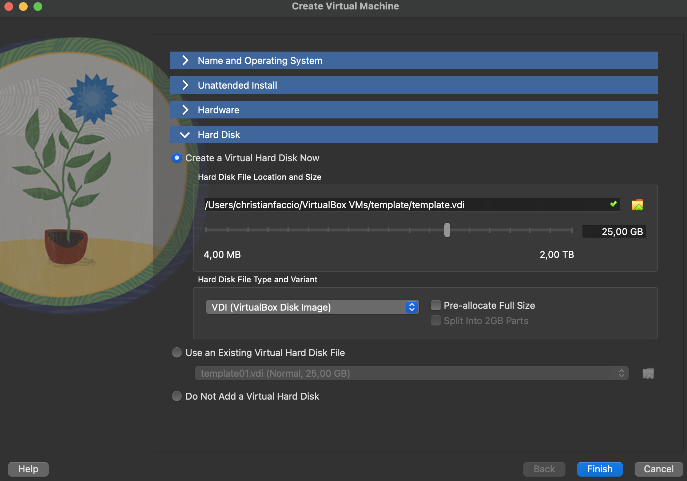
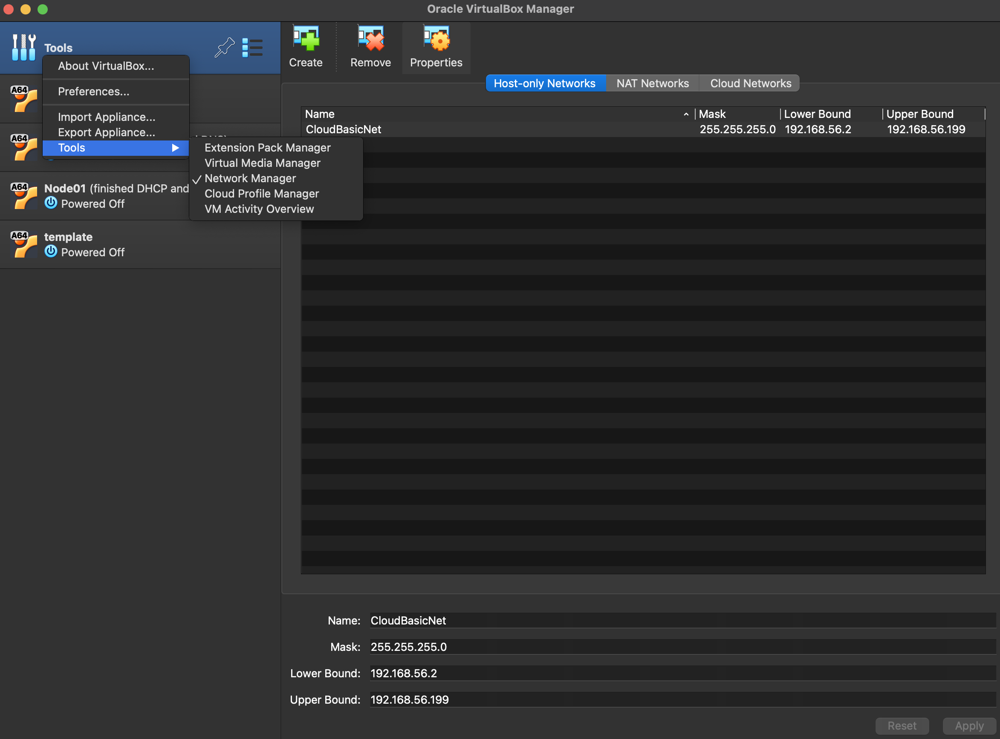
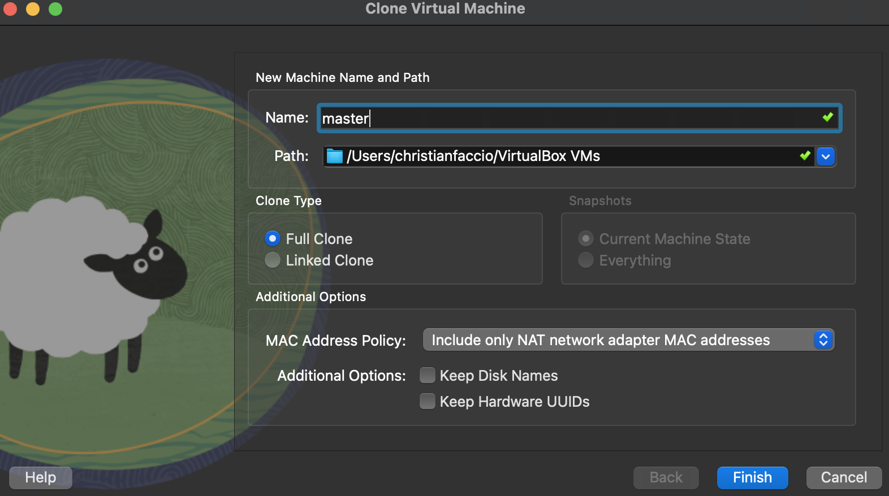
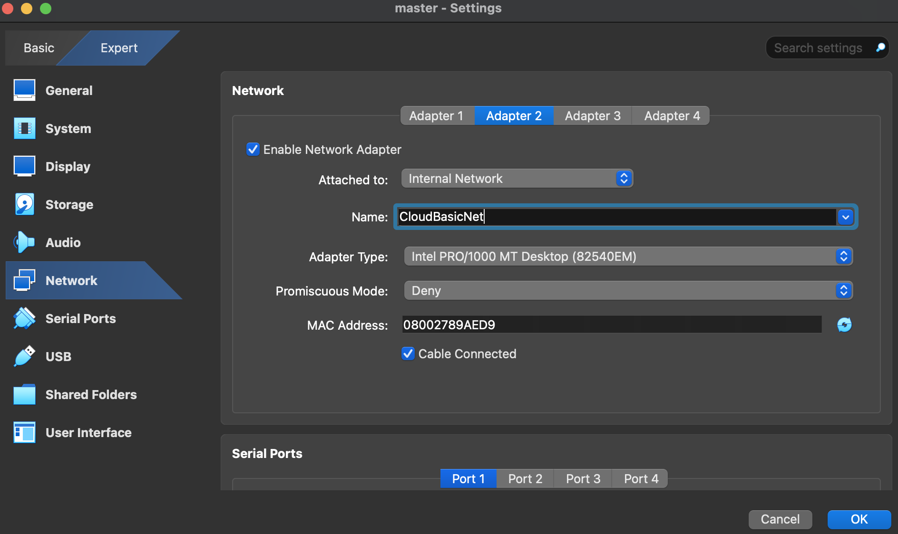
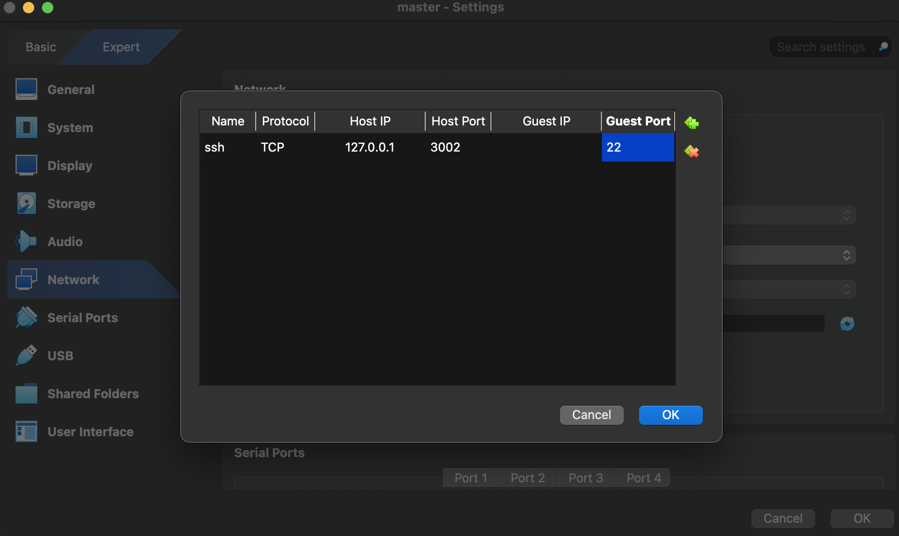
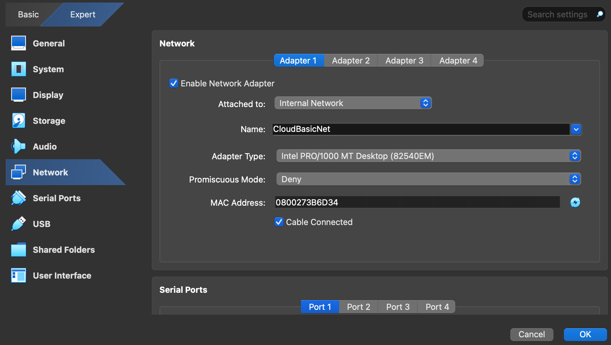

<div align="center">
    <h1>Cloud Computing Basic Report</h1>
    <h3>Author: Christian Faccio</h3>
    <h5>Email: christianfaccio@outlook.it</h4>
    <h5>Github: <a href="https://github.com/christianfaccio" target="_blank">christianfaccio</a></h5>
    <h6>The following project aims to create a cluster of machines departing from two different approaches: Virtual machines and Docker containers. By implementing both, it is possible to compare the performance and efficiency of virtualized versus containerized clustering.</h6>
</div>

---


## Table of Contents
- [Requirements](#requirements)
- [VM Cluster](#vm-cluster)
  - [Specifications](#specifications)
  - [Configuring the template VM](#configuring-the-template-vm)
  - [Master Node](#master-node)
    - [Initial Settings](#initial-settings)
    - [SSH Connection](#ssh-connection)
    - [Network Configuration](#network-configuration)
  - [Working Nodes](#working-nodes)
  - [DHCP and DNS Configuration](#dhcp-and-dns-configuration)
  - [Master Node as Gateway](#master-node-as-gateway)
  - [SSH on Working Node](#ssh-on-working-node)
  - [Distributed Filesystem](#distributed-filesystem)
- [Container Cluster](#containercluster)
  - [Configuring the files](#configuring-the-files)
  - [Starting the containers](#starting-the-containers)
- [Measuring Performances](#measuring-performances)
  - [HPCC](#hpcc)
  - [Network](#network-iperf3)
  - [Stress_ng](#stress_ng)
  - [Sysbench](#sysbench)
  - [Disk I/O](#disk-io-iozone)

The instructions below allowed me to create a cluster of VM and of containers. For the Virtual Machines I have used VirtualBox and for the containers Docker, but the general concepts can be applied to other virtualization software with the right changes. 

Important things:
- I have used MacOS as the host operating system
- The VMs are running Ubuntu 20.04
- The VM cluster comprises one master node and two working nodes
- Only the master node VM is connected to the internet through a NAT connection
- Working nodes are connected to the master node via Internal Network

## Requirements

1. Download [VirtualBox](https://www.virtualbox.org/wiki/Downloads)
2. Download [Ubuntu 20.04](https://ubuntu.com/download/desktop)
3. Download [Docker](https://www.docker.com/products/docker-desktop/)

---

## VM Cluster

### Specifications


|  |Master Node | Working Node 1 | Working Node 2 |
|----------|----------|----------|----------|
| vCPU | 2 | 2 | 2 |
| RAM | 2048MB | 2048MB | 2048MB|
| SSD | 25GB | 25GB | 25GB |


### Configuring the template VM

1. Create a machine and name it **template**
2. Choose a location (usually, leave it as default)
3. Load the ISO image

4. Change username and password if you want, but remember them for the next steps

5. Assign the resources as specified in the requirements


6. Finish the setup and start the machine
7. Once started and logged in, update the system
```bash
sudo apt update
sudo apt upgrade
```
and try to ping any public site (e.g. google.com or 8.8.8.8) to check the internet connection
```bash
ping google.com
ping 8.8.8.8
```
> ⚠️ **Warning**: DNS
>It could happen that pinging a domain name does not work. In >this case, check the
>DNS settings:
>```bash
>cat /etc/resolv.conf
>```
>If it is empty or does not contain a valid nameserver, add >one:
>```bash
>echo "nameserver 8.8.8.8" | sudo tee /etc/resolv.conf
>```
>Now you can try again to ping a domain name and it should >work.
**Remember that the VM by default uses the American keyboard layout.**

You can also check the DHCP-assigned IP address by entering one of the following commands:
```bash
hostname -I #returns the IP address of the machine
ip a #returns the IP address and the network interface
ip route show #returns the routing table
```

This is the default IP address assigned by your network DHCP. Note that this IP address is
dynamic and can change or worst still, get assigned to another machine. But for now, you
can connect to this IP from your host machine via SSH.
Now install some useful additional packages:

```bash
sudo apt install net-tools
sudo apt install gcc make
```

If everything is ok, we can proceed cloning this template. You must shutdown the node to
clone it, using VirtualBox interface (select VM and right click) create 2 new VMs.

```bash
sudo shutdown -h now
```

Configure the VirtualBox internal network: open Tools→Network Manager and create a
new one named CloudBasicNet
```bash
Mask: 255.255.255.0
Lower Bound: 192.168.56.2
Upper Bound: 192.168.56.199
```
**.1** is typically reserved for the gateway, the rest of the range (from .2 to .199 ) is allocated to virtual machines (VMs) dynamically by the DHCP server. This setup ensures controlled
IP allocation within **192.168.56.2 - 192.168.56.199** , avoiding conflicts with the host
or other network elements.



### Master Node

It is time now to create the first clone, the Master Node. To do so, right click on the template VM
and select Clone. Name it **master** and proceed with the cloning.



Before starting the master node VM, we need to configure the network settings and the port forwarding for ssh connection.

#### Initial Settings
- First things first, and since the hostname is still the same as the template, we need to change it. Edit
the file **/etc/hostname** and replace the current hostname with the new one. Save and exit.
```bash
sudo vim /etc/hostname # Replace the current hostname with the new one (master)
```
Restart the master node VM to apply the changes:
```bash
sudo shutdown -h now
```
- Go to the network settings of the master node and enable the Adapter 2, setting it as Internal
Network and CloudBasicNet. This will allow the master node to communicate with the working
nodes.

- Go now to the port forwarding settings in the Adapter 1 and add a new rule for SSH connection. For the host port, any available port on your host machine can be used, as long as it is not already in use by another process. The guest port is typically the default SSH port inside the guest VM (or container), usually port 22, unless you’ve configured the guest OS to use a different port.
This will allow you to connect to the master node via SSH.


Save the settings and start the master node VM.

#### SSH connection

You can bootstrap the VM and ssh from a terminal of your Host Machine (if you like).
On the master node, install the openssh-server package:
```bash
sudo apt install openssh-server -y
```
And check its status, if it is not running, start it:
```bash
sudo systemctl status ssh
sudo systemctl enable ssh
```
Now on your host machine, you can connect to the master node via SSH:
```bash
ssh -p 3002 <username>@127.0.0.1
```
> **Warning**: an error message like the one below could appear in this phase:
>```bash
>ssh -p 3002 christianvm@127.0.0.1
>@@@@@@@@@@@@@@@@@@@@@@@@@@@@@@@@@@@@@@@@@@@@@@@@@@@@@@@@@@@
>@    WARNING: REMOTE HOST IDENTIFICATION HAS CHANGED!     @
>@@@@@@@@@@@@@@@@@@@@@@@@@@@@@@@@@@@@@@@@@@@@@@@@@@@@@@@@@@@
> ...

If you want to avoid typing the password every time you connect via SSH, you can set up a
passwordless SSH connection. To do so, generate a new SSH key pair on your host machine:
```bash
ssh-keygen -t rsa # Press Enter to save the key in the default location
````

Copy the public key to the master node:
```bash
ssh-copy-id -p 3002 <username>@127.0.0.1
```
Now you can connect to the master node without typing the password.

#### Network Configuration

Let’s now check the network settings. The master node should have two network interfaces: one
connected to the internet (NAT) and the other connected to the internal network.
```bash
ip link show

1: lo: <LOOPBACK,UP,LOWER_UP> mtu 65536 qdisc noqueue state UNKNOWN mode
DEFAULT group default qlen 1000
link/loopback 00:00:00:00:00:00 brd 00:00:00:00:00:00
2: enp0s8: <BROADCAST,MULTICAST,UP,LOWER_UP> mtu 1500 qdisc fq_codel
state UP mode DEFAULT group default qlen 1000
link/ether 08:00:27:3b:6d:34 brd ff:ff:ff:ff:ff:ff
3: enp0s9: <BROADCAST,MULTICAST> mtu 1500 qdisc noop state DOWN mode
DEFAULT group default qlen 1000
link/ether 08:00:27:89:ae:d9 brd ff:ff:ff:ff:ff:ff
```
 
If you look closely, you will see that the interface **enp0s8** is connected to the internet (NAT)
and the interface **enp0s9** is connected to the internal network, but the VM does not have an IP
address assigned to it. Now we will configure the adapter, i.e. assign an IP address to the interface
**enp0s9** . It will be the master node so it will act as a gateway for the working nodes and will have
IP **192.168.0.1**.

```bash
sudo vim /etc/netplan/50-cloud-init.yaml

network:
    ethernets:
        enp0s8:
            dhcp4: true
        enp0s9:
            dhcp4: false
            addresses: [192.168.0.1/24]
    version: 2
```

Apply the changes with the following command:

```bash
sudo netplan apply
```

> **Observation**: Master Node IP
The master node has a static IP on the internal network since it will act as a gateway for the
working nodes. The working nodes will have dynamic IPs assigned by the DHCP server
running on the master node.

Edit the hosts file to assign names to the cluster that should include names for each node as follows:
```bash
sudo vim /etc/hosts

127.0.0.1 localhost
192.168.0.1 master

# The following lines are desirable for IPv6 capable hosts
::1 ip6-localhost ip6-loopback
fe00::0 ip6-localnet
ff00::0 ip6-mcastprefix
ff02::1 ip6-allnodes
ff02::2 ip6-allrouters
```

We do not specify a static IP for the working nodes since we will later set up a DHCP server on the
master node to assign IPs dynamically to the working nodes.


### Working Nodes

Now redo the same process for the two working nodes.

Open VirtualBox and clone the above create **template**, creating **node1** and **node2**.

Go on the settings of each working node, on the Network tab, and select Internal Network for Adapter1, name it as the one of the master node (ClusterVimNet in this case). 



Click "ok" and start the VMs.

For each VM, change the hostname and the hosts file:
```bash
sudo vim /etc/hostname #change the name and insert the right one for each VM (the one you setted in VirtualBox)
```
```bash 
sudo vim /etc/hosts

127.0.0.1 localhost
192.168.0.1 master

# The following lines are desirable for IPv6 capable hosts
::1 ip6-localhost ip6-loopback
fe00::0 ip6-localnet
ff00::0 ip6-mcastprefix
ff02::1 ip6-allnodes
ff02::2 ip6-allrouters
```

Restart the VMs to apply the changes.

### DHCP and DNS configuration

To configure DHCP on your master node, you can use a tool like dnsmasq or isc-dhcp-server. Since
you’re setting up a network and assigning IPs dynamically, let’s go through the configuration steps
using dnsmasq, which is lightweight and commonly used for DHCP and DNS management.

Here are the steps to set up DHCP on the master node:
1. Start the **master** node VM, log in, and install dnsmasq:
```bash 
sudo apt update
sudo apt install dnsmasq -y
```
2. Configure dnsmasq: Edit the configuration file **/etc/dnsmasq.conf**:
```bash 
sudo vim /etc/dnsmasq.conf
```
Add the following lines to the configuration file:
```bash 
# Specify the internal network interface (change if needed)
interface=enp0s9s  # Use the correct internal interface (check with `ip a`)

# DHCP range (adjust as needed)
dhcp-range=192.168.0.100,192.168.0.200,12h  # Assign IPs in this range for 12 hours

# Set the gateway (the master node itself)
dhcp-option=3,192.168.0.1  

# Set the DNS server (the master node itself)
dhcp-option=6,192.168.0.1  

# Local DNS resolution
local=/cluster.local/
expand-hosts
domain=cluster.local
```

Replace **enp0s9** with the name of the internal network interface.

3. Ensure the master node has a static IP on its internal network interface (**enp0s9**):
```bash 
sudo vim /etc/network/interfaces

auto enp0s9
iface enp0s9 inet static
address 192.168.1.1
netmask 255.255.255.0
```

Restart the dnsmasq service to apply the changes:
```bash
sudo systemctl restart dnsmasq
sudo systemctl enable dnsmasq
```

4. Ensure IP Forwarding is Enabled
Edit `/etc/sysctl.conf`
```bash
net.ipv4.ip_forward=1 #uncomment this line
```

Apply changes:
```bash
sudo sysctl -p
```

Now the working node should now have an IP address assigned by the DHCP server running on
the master node. 

5. Test connection pinging the master node
```bash
ping 192.168.0.1
```

### Master node as Gateway

To let the working node connect to the internet, you have to setup the master node as the default gateway. 
Enable NAT on the Master Node. Assuming your master node has two interfaces:
- **enp0s8** connected to the internet (NAT)
- **enp0s9** connected to the internal network
Run the following command:
```bash
sudo iptables -t nat -A POSTROUTING -o enp0s8 -j MASQUERADE
sudo iptables -A FORWARD -i eth1 -o eth0 -j ACCEPT
sudo iptables -A FORWARD -i eth0 -o eth1 -m state --state RELATED,ESTABLISHED -j ACCEPT
```
Replace enp0s8 with the name of the interface connected to the internet.
To persist the rules:
```bash
sudo apt-get install iptables-persistent # For Debian/Ubuntu
sudo netfilter-persistent save
sudo netfilter-persistent reload
```
Configure the Woring Node to Use the Master Node as a Gateway. On the working node, set
the master node as the default gateway:
```bash
sudo ip route add default via <MASTER\_NODE\_IP>
```

You are now connected to the Internet, try to ping:
```bash
ping 8.8.8.8
```

> **Warning**: DNS is not configured yet, so pinging google.com as an example will not work

To add DNS resolution, modify the `/etc/netplan/50-cloud-init.yaml`file in the working node, this way:
```bash
network:
    ethernets:
        enp0s8:
            dhcp4: true
            dhcp-identifier: mac
            nameservers:
                addresses: [192.168.0.1, 8.8.8.8, 8.8.4.4]
    version: 2
```
Try to ping a domain name:
```bash
ping google.com
```

### SSH on working node

Install SSH server in the working node:
```bash
sudo apt update
sudo apt install openssh-server -y
```

Start and enable SSH server:
```bash 
sudo systemctl enable ssh
sudo systemctl status ssh
```

Now you can ssh into the working node from the master node:
```bash
ssh <username>@<working\_node\_IP>
```
To know the working node IP, since it is assigned dynamically, you can check it with the following
command in the working node:
```bash 
hostname -I
```

>**Tip:** to have a passwordless access via ssh, generate a new SSH key pair on your master node:
>```bash 
>ssh-keygen -t rsa -b 4096 # Press Enter to save the key in the default location
>```
>Copy the public key to the working node
>```bash 
>ssh-copy-id user@<working_node_IP>
>``` 
>Set the correct permissions on the working node
>```bash 
>chmod 700 ~/.ssh
>chmod 600 ~/.ssh/authorized_keys
>````
>Test ssh connection
>```bash
>ssh user@<working_node_IP>
>```

Now just clone this working node to create as many other nodes as you want, change their hostname and you are set up. Remember to check if they have the same IP assigned.

### Distributed Filesystem

NFS is one of the most commonly used distributed file systems for sharing files across multiple
nodes in a network.
1. Install the NFS server package on the master node:
```bash 
sudo apt install nfs-kernel-server
``` 

2. Create a directory to share:
```bash 
sudo mkdir /shared
sudo chmod 777 /mnt/shared
``` 
3. Configure the NFS server: Edit the file `/etc/exports`:
```bash 
sudo vim /etc/exports
``` 
and add the following line in the file:
```bash 
/shared 192.168.0.0/24(rw,sync,no_subtree_check) #This allows all nodes in the 192.168.0.0 network to access the shared folder.
``` 
Replace `<working_node_IP>` with the IP address of the working node.
4. Export the shared directory:
```bash 
sudo exportfs -a
``` 
5. Restart the NFS server to apply the changes:
```bash
sudo systemctl restart nfs-kernel-server
sudo systemctl enable nfs-kernel-server
```
6. Install the NFS client package on the working node:
```bash 
sudo apt install nfs-common
```
7. Create a directory to mount the shared directory:
```bash 
sudo mkdir /shared
```
8. Mount the shared directory on the working node:
```bash 
sudo mount <master\_node\_IP>:/shared /shared

df -h
...
192.168.0.1:/shared 24G 2.8G 20G 13% /shared #you should see this line
```
Replace `<master_node_IP>` with the IP address of the master node.

Try now to create a file in the `/shared` folder in the master node:
```bash 
touch /shared/test.txt
```

You should see this file in the working nodes:
```bash 
ls /shared
```

9. Make the mount permanent. In the working nodes, edit the `/etc/fstab` file adding the following line:
```bash 
192.168.0.1:/mnt/shared /mnt/shared nfs defaults 0 0
```
Save and exit, then run:
```bash 
sudo mount -a
```

---

## Containers' Cluster

### Configuring the files

- `dockerfile`
```bash
FROM ubuntu:latest

# Set non-interactive mode for apt-get
ENV DEBIAN_FRONTEND=noninteractive

# Install required packages
RUN apt-get update && apt-get install -y \
    openssh-server rsync iputils-ping \
    sysbench stress-ng iozone3 iperf3 \
    netcat-openbsd wget unzip hpcc \
    mpich vim \
    openmpi-bin openmpi-common openmpi-doc libopenmpi-dev \
    sudo \
    && rm -rf /var/lib/apt/lists/*

# Create SSH folder and set correct permissions
RUN mkdir -p /var/run/sshd /home/user/.ssh /shared \
    && chmod 700 /home/user/.ssh

# Create a new user 'user' with a home directory
RUN useradd -m -s /bin/bash user \
    && echo "user:userpassword" | chpasswd \
    && echo "user ALL=(ALL) NOPASSWD:ALL" >> /etc/sudoers

# Ensure SSH is configured for user
RUN sed -i 's/#PermitRootLogin prohibit-password/PermitRootLogin no/' /etc/ssh/sshd_config \
    && sed -i 's/UsePAM yes/UsePAM no/' /etc/ssh/sshd_config \
    && sed -i 's/#PubkeyAuthentication yes/PubkeyAuthentication yes/' /etc/ssh/sshd_config \
    && sed -i 's|#AuthorizedKeysFile.*|AuthorizedKeysFile .ssh/authorized_keys|' /etc/ssh/sshd_config

# Copy SSH keys for user (passwordless login)
COPY ssh_keys/id_rsa.pub /home/user/.ssh/authorized_keys
COPY ssh_keys/id_rsa /home/user/.ssh/id_rsa

# Set correct permissions for SSH keys (user)
RUN chmod 600 /home/user/.ssh/id_rsa /home/user/.ssh/authorized_keys \
    && chown -R user:user /home/user/.ssh

# Expose SSH port
EXPOSE 22

# Switch to user
USER user
WORKDIR /home/user

# Start SSH service correctly with host key generation
CMD sudo ssh-keygen -A && sudo /usr/sbin/sshd -D -e && sudo chown -R user:user /shared && sudo chmod -R 777 /shared
```

- `docker-compose.yaml`
```bash 

services:
  master1:
    build: .
    container_name: master
    networks:
      - my_network
    deploy:
      resources:
        limits:
          cpus: "2"
          memory: 2G
    ports:
      - "2220:22"
    volumes:
      - shared_volume:/shared
      - ./ssh_keys:/root/.ssh # Mount pre-generated SSH keys for passwordless access
    tmpfs:
      - /shared:mode=777

  node1:
    build: .
    container_name: node1
    networks:
      - my_network
    deploy:
      resources:
        limits:
          cpus: "2"
          memory: 2G
    ports:
      - "2221:22"
    volumes:
      - shared_volume:/shared
      - ./ssh_keys:/root/.ssh
    tmpfs:
      - /shared:mode=777
  node2:
    build: .
    container_name: node2
    networks:
      - my_network
    deploy:
      resources:
        limits:
          cpus: "2"
          memory: 2G
    ports:
      - "2222:22"
    volumes:
      - shared_volume:/shared
      - ./ssh_keys:/root/.ssh
    tmpfs:
      - /shared:mode=777

networks:
  my_network:
    driver: bridge

volumes:
  shared_volume:
    driver: local
```
---
### Starting the containers

Generate SSH keys on your host in the project folder:
```bash 
mkdir -p ssh_keys
ssh-keygen -t rsa -b 4096 -f ssh_keys/id_rsa -N ""
```

Verify the permissions:
```bash 
chmod 600 ssh_keys/id_rsa
chmod 644 ssh_keys/id_rsa.pub
```


Now you can start the setup:
```bash 
docker compose up -d
```

To confirm:
```bash 
docker ps
```

Try to SSH:
- master node
```bash 
ssh -i ssh_keys/id_rsa -p 2220 user@localhost
```
- node 1
```bash 
ssh -i ssh_keys/id_rsa -p 2221 user@localhost
```
- node 2
```bash 
ssh -i ssh_keys/id_rsa -p 2222 user@localhost
```
>**Observation**: to stop all the containers type `docker stop $(docker ps -q)`

>**WARNING**: If the `man in the middle` attack occurs, just remove the old key from the `~/.ssh/known_hosts` file in your host

Now the cluster should work fine and should ensure passwordless ssh connection between all nodes and between them and the host. 

>**WARNING**: `bash: history: /home/user/.bash_history: cannot create: Permission denied`, if it occurs, just create the `.bash_history`file with this command `sudo touch /home/user/.bash_history`.
---
### Measuring Performances

#### HPCC

The **HPCC (High-Performance Computing Challenge)** test suite is a collection of benchmarks designed to evaluate the performance of supercomputers and distributed computing systems. It includes tests for computational power, memory bandwidth, and inter-node communication. These benchmarks provide insights into different aspects of system performance, helping compare architectures and optimize computational workloads.

- **VM**
  1. Install HPCC on every node
  ```bash
  sudo apt update
  sudo apt install -y hpcc
  ```

  2. Install OpenMPI on every node:
  ```bash 
  sudo apt install -y openmpi-bin libopenmpi-dev
  ```

  >**Warning**: ensure there is a passwordless ssh connection between master and working nodes, try it manually for every combination

  3. On the master node, generate the HPCC configuration file:
  ```bash 
  vim hpccinf.txt
  ```
  Modify:
  - **Processor Count**: Set the total number of CPU cores in the cluster.
  - **Memory Size**: Adjust based on available RAM.
  - **MPI Settings**: Ensure correct paths.

  Check https://www.advancedclustering.com/act_kb/tune-hpl-dat-file/ to use the right parameters for your cluster.

  For me:
  ```bash 
  HPLinpack benchmark input file
  Innovative Computing Laboratory, University of Tennessee
  HPL.out      output file name (if any) 
  6            device out (6=stdout,7=stderr,file)
  1            # of problems sizes (N)
  20352         Ns
  1            # of NBs
  192           NBs
  0            PMAP process mapping (0=Row-,1=Column-major)
  1            # of process grids (P x Q)
  2            Ps
  2            Qs
  16.0         threshold
  1            # of panel fact
  2            PFACTs (0=left, 1=Crout, 2=Right)
  1            # of recursive stopping criterium
  4            NBMINs (>= 1)
  1            # of panels in recursion
  2            NDIVs
  1            # of recursive panel fact.
  1            RFACTs (0=left, 1=Crout, 2=Right)
  1            # of broadcast
  1            BCASTs (0=1rg,1=1rM,2=2rg,3=2rM,4=Lng,5=LnM)
  1            # of lookahead depth
  1            DEPTHs (>=0)
  2            SWAP (0=bin-exch,1=long,2=mix)
  64           swapping threshold
  0            L1 in (0=transposed,1=no-transposed) form
  0            U  in (0=transposed,1=no-transposed) form
  1            Equilibration (0=no,1=yes)
  8            memory alignment in double (> 0)
  ##### This line (no. 32) is ignored (it serves as a separator). ######
  0                               Number of additional problem sizes for PTRANS
  1200 10000 30000                values of N
  0                               number of additional blocking sizes for PTRANS
  40 9 8 13 13 20 16 32 64        values of NB
  ```

  Create the Hosts File on the Master Node:
  ```bash 
  vim hosts
  ```

  and add the following lines:
  ```bash
  <worker_node_1_IP> slots=<n_cores_worker_1>
  <worker_node_2_IP> slots=<n_cores_worker_2>
  ```

  4. Run HPCC with the correct path:
  ```bash 
  mpirun -np 4 -hostfile hosts hpcc
  ```
  This will run the HPCC tests on the working nodes. To see results open the `hpccoutf.txt` file. 

  >**WARNING**: SSH connection MUST be passwordless between all the nodes, otherwise you will get an error

  >**TIP**: The files `hosts` and `hpccinf.txt` created before can be put in the distributed system between all the nodes, this way it is simpler to give the right permissions to the nodes to read the files. 


- **Containers**

  We have already installed the packages required (see `dockerfile`). So, after having checked the passwordless ssh connection between every pair of nodes, just run the test.

  1. Create the `hpccinf.txt` file:
  ```bash
  sudo vim hpccinf.txt 
  ```
  2. Insert the same code as before, for me:
  ```bash 
  HPLinpack benchmark input file
  Innovative Computing Laboratory, University of Tennessee
  HPL.out      output file name (if any) 
  6            device out (6=stdout,7=stderr,file)
  1            # of problems sizes (N)
  20352         Ns
  1            # of NBs
  192           NBs
  0            PMAP process mapping (0=Row-,1=Column-major)
  1            # of process grids (P x Q)
  2            Ps
  2            Qs
  16.0         threshold
  1            # of panel fact
  2            PFACTs (0=left, 1=Crout, 2=Right)
  1            # of recursive stopping criterium
  4            NBMINs (>= 1)
  1            # of panels in recursion
  2            NDIVs
  1            # of recursive panel fact.
  1            RFACTs (0=left, 1=Crout, 2=Right)
  1            # of broadcast
  1            BCASTs (0=1rg,1=1rM,2=2rg,3=2rM,4=Lng,5=LnM)
  1            # of lookahead depth
  1            DEPTHs (>=0)
  2            SWAP (0=bin-exch,1=long,2=mix)
  64           swapping threshold
  0            L1 in (0=transposed,1=no-transposed) form
  0            U  in (0=transposed,1=no-transposed) form
  1            Equilibration (0=no,1=yes)
  8            memory alignment in double (> 0)
  ##### This line (no. 32) is ignored (it serves as a separator). ######
  0                               Number of additional problem sizes for PTRANS
  1200 10000 30000                values of N
  0                               number of additional blocking sizes for PTRANS
  40 9 8 13 13 20 16 32 64        values of NB
  ```
  3. Create the `hosts` file as before (remember to check the IP of the workers with `hostname -I`):
  ```bash 
  sudo vim hosts

  <worker_node_IP> slots=2
  <worker_node_IP> slots=2
  ````
  >**Observation**: you can set the number of slots (cores) you want, just remember to modify also the `hpccinf.txt` file

  4. Run the test with `mpirun -np 4 -hostfile hosts hpcc`
  


Below are the performance values for the 13 tests of the HPCC suite.

| **Test** | **Unit** | **VMs** | **Containers** | **Comment** |
|----------|--------|----------------|----------------|----------|
| **MPIRandomAccess** | GUP/s | 0.0033 | 0.010 | The MPIRandomAccess benchmark measures random updates on a distributed array using MPI. The result reflects how well parallel random updates perform. |
| **StarRandomAccess** | GUP/s | 0.0687 | 0.074 | StarRandomAccess tests random access with a star topology, where a central node communicates with all others, measuring efficiency in this setup. |
| **SingleRandomAccess** | GUP/s | 0.0921 | 0.101 | This benchmark measures random access performance on a single node without any distributed environment. It shows the efficiency of local memory access. |
| **MPIRandomAccess_LCG** | GUP/s | 0.0032 | 0.009 | MPIRandomAccess_LCG uses a Linear Congruential Generator for random access, testing how deterministic sequences affect performance in MPI. |
| **StarRandomAccess_LCG** | GUP/s | 0.067 | 0.078 | StarRandomAccess_LCG tests random access in a star topology using an LCG sequence, assessing the impact of predictable access patterns. |
| **SingleRandomAccess_LCG** | GUP/s | 0.086 | 0.105 | This is a variant of SingleRandomAccess, using an LCG sequence for random access on a single machine. It helps measure the effect of deterministic access. |
| **PTRANS** | s | Wall: 0.550, CPU: 4.273 | Wall: 0.42s, CPU: 0.29s| PTRANS benchmarks matrix transposition performance, testing the efficiency and accuracy of large-scale transposition operations in memory. |
| **StarDGEMM** | Gflop/s | 2.909 | 3.95 | StarDGEMM benchmarks the General Matrix Multiply operation in a star topology, measuring the performance of matrix multiplication across multiple nodes. |
| **SingleDGEMM** | Gflop/s | 4.34 | 5.23 | SingleDGEMM measures the performance of DGEMM on a single node, giving a local baseline for computationally intense tasks like matrix multiplication. |
| **StarSTREAM Copy** | GB/s | 23.20 | 21.66 | StarSTREAM tests memory bandwidth using different memory operations (copy, scale, add, triad) in a star topology, showing how memory bandwidth scales with multiple nodes. |
| **SingleSTREAM Copy** | GB/s | 41.50 | 62.36 | SingleSTREAM benchmarks memory bandwidth in a single node environment, helping to compare local vs. distributed memory operation performance. |
| **MPIFFT** | Gflop/s | 2.133 | 8.43 | MPIFFT tests the performance of Fast Fourier Transform (FFT) in MPI, measuring computational performance and accuracy in signal processing tasks. |
| **StarFFT** | Gflop/s | 3.44 | 4.83 | StarFFT measures the performance of FFT in a star topology, showing how the distributed system performs with parallelized signal processing operations. |
| **SingleFFT** | Gflop/s | 4.07 | 6.29 | SingleFFT benchmarks FFT performance on a single node, providing a local baseline for comparing distributed FFT performance. |
| **Avg. Ping Pong Latency** | ms | 0.098786 | 0.002310 | Latency-Bandwidth tests communication latency and bandwidth using the ping pong method, providing insights into the efficiency of inter-process communication in MPI. |
| **Avg. Ping Pong Bandwidth** | GB/s | 4.756 | 17.148 | The benchmark measures inter-node communication performance, showing how bandwidth scales with message sizes and network efficiency. |
| **HPL** | Gflop/s | 10.64 | 12.32 | HPL measures high-performance computing power by solving a large linear system, with the result in Gflops indicating computational speed for large-scale tasks. | 

The HPCC benchmark suite was executed in two different environments: **virtual machines (VMs) and containers**. The results indicate that **containers generally outperform VMs across most tests**, highlighting their efficiency in computational and memory-intensive operations.   

1. **Ping Pong Latency**:
   - The **Avg. Ping Pong Latency** for containers is significantly lower (0.002310 ms) compared to VMs (0.098786 ms). This indicates that containers have a much faster inter-process communication, which is crucial for distributed applications where low latency is important.
   - The lower latency in containers suggests reduced overhead, as containers share the host OS kernel, avoiding the virtualization overhead associated with VMs.

2. **Ping Pong Bandwidth**:
   - The **Avg. Ping Pong Bandwidth** is significantly better in containers (17.148 GB/s) compared to VMs (4.756 GB/s). This shows that containers can handle higher bandwidth between nodes, making them more efficient for communication-heavy tasks.
   - Containers benefit from more direct access to the host system's network resources, whereas VMs are limited by the overhead introduced by the hypervisor and virtualized network interfaces.

3. **Performance Impact**:
   - The results suggest that containers offer better performance in terms of both latency and bandwidth due to their lighter-weight nature. VMs, on the other hand, incur more overhead due to the need for a hypervisor layer, which can reduce communication efficiency.
   - For high-performance applications that require frequent and fast communication (e.g., MPI-based tasks, network-heavy computations), containers appear to be a better choice compared to VMs.

4. **Efficiency**:
   - Containers have less overhead in terms of system resources compared to VMs, as containers do not require a full operating system for each instance. This leads to better resource utilization, lower latency, and higher throughput in many cases.
   - VMs provide stronger isolation and may be necessary when strong separation between tasks or services is required, but for tasks where performance is the priority, containers are more efficient.

Conclusion:
   - **Containers** outperform **VMs** in terms of communication latency and bandwidth, making them a better choice for distributed applications and tasks that involve heavy inter-process communication.
   - **VMs** may still be preferred in environments where stronger isolation between processes or security is needed, but for performance-sensitive tasks, containers offer a more efficient solution.
**Conclusion**  

Overall, containers provide a **more efficient execution environment** for most HPCC workloads, especially in **memory access, computational efficiency, and communication latency**, making them a compelling choice for HPC workloads.

---

#### Network (iPerf3)

**iPerf3** is a network performance measurement tool used to test bandwidth, latency, and jitter between two endpoints. It is commonly used for evaluating network throughput and diagnosing performance bottlenecks.

iPerf3 test:
- One device acts as a **server** (`iperf3 -s`), while another runs as a **client** (`iperf3 -c <server-IP>`).  
- Supports TCP and UDP protocols, allowing for **bandwidth, jitter, and packet loss analysis**. 
- Users can adjust:
  - **Test duration**
  - **Parallel streams**
  - **Window size**  
This helps simulate different network conditions.
- Measures **upload and download speeds** separately or simultaneously.
- Reports:
  - **Bandwidth**
  - **Retransmissions**
  - **Congestion control details** 

iPerf3 is widely used in networking to analyze **link capacity, detect bottlenecks, and compare performance** across different network configurations.

Install `iperf3` (if using VMs):
```bash 
sudo apt update && sudo apt install iperf3
```


To run it, start the server in a node using the command `iperf3 -s`. Then, run iperf3 client in another node using the command `iperf3 -c <server_IP>`.

The following are the results I obtained:
- **VM**
  | Test                         | Interval   | Transfer (GBytes) | Bitrate (Gbits/sec) | Retransmits | Comments                               |
  |------------------------------|------------|-------------------|---------------------|-------------|----------------------------------------|
  | **Master - Node1 (Sender)**   | 0-10 sec   | 2.09               | 1.79                | 315         | Stable performance, moderate retransmits. |
  | **Master - Node1 (Receiver)** | 0-10 sec   | 2.09               | 1.79                | 0           | High throughput with no retransmits.   |
  | **Node1 - Node2 (Sender)**    | 0-10 sec   | 2.15               | 1.84                | 270         | Stable performance, slight fluctuations. |
  | **Node1 - Node2 (Receiver)**  | 0-10 sec   | 2.15               | 1.84                | 0           | Stable throughput, minimal retransmits. |

  **Reverse Mode**:

  | Test                         | Interval   | Transfer (GBytes) | Bitrate (Gbits/sec) | Retransmits | Comments                               |
  |------------------------------|------------|-------------------|---------------------|-------------|----------------------------------------|
  | **Master - Node1 (Receiver)** | 0-10 sec   | 2.34               | 2.01                | 1041        | High throughput with significant retransmits. |
  | **Master - Node1 (Sender)**   | 0-10 sec   | 2.34               | 2.01                | 0           | Stable throughput with no retransmits. |
  | **Node1 - Node2 (Receiver)**  | 0-10 sec   | 2.07               | 1.78                | 45          | Slight drop in throughput compared to Sender test. |
  | **Node1 - Node2 (Sender)**    | 0-10 sec   | 2.07               | 1.78                | 0           | Good throughput with minimal retransmits. |

  **Analysis**

  - The tests show good throughput between nodes, with average transfer rates ranging from 1.78 to 2.01 Gbits/sec.
  - There were moderate retransmits in the forward direction, especially from Master to Node1, but overall performance remains stable.
  - Reverse mode tests generally show higher throughput, but with more retransmits, especially in the Master to Node1 direction.
  - Overall, the performance is consistent with minor fluctuations in the throughput.

- **Containers**
  | Test             | Interval   | Transfer (GBytes) | Bitrate (Gbits/sec) | Retransmits | Comments                        |
  |------------------|------------|-------------------|---------------------|-------------|---------------------------------|
  | **Master01 - Node01 (Sender)** | 0-10 sec   | 142               | 122                 | 1           | Stable performance, slight retransmit.  |
  | **Master01 - Node01 (Receiver)** | 0-10 sec   | 142               | 122                 | 0           | High throughput with minimal retransmits. |
  | **Node01 - Node02 (Sender)**   | 0-10 sec   | 140               | 120                 | 2           | Slight drop in bitrate towards the end. |
  | **Node01 - Node02 (Receiver)** | 0-10 sec   | 140               | 120                 | 0           | Consistent throughput but some retransmits. |

  **Reverse Mode**:

  | Test             | Interval   | Transfer (GBytes) | Bitrate (Gbits/sec) | Retransmits | Comments                        |
  |------------------|------------|-------------------|---------------------|-------------|---------------------------------|
  | **Master01 - Node01 (Receiver)** | 0-10 sec   | 141               | 121                 | 2           | Slight variation in throughput, minimal retransmits. |
  | **Master01 - Node01 (Sender)**   | 0-10 sec   | 141               | 121                 | 0           | Consistent throughput with minimal retransmits. |
  | **Node01 - Node02 (Receiver)** | 0-10 sec   | 137               | 118                 | 1           | Stable performance but slight drop in throughput. |
  | **Node01 - Node02 (Sender)**   | 0-10 sec   | 137               | 118                 | 0           | Good throughput, slight retransmits towards the end. |

  **Analysis**:

  - The tests show good throughput between nodes, with average transfer rates ranging from 118 to 122 Gbits/sec.
  - There were some minor retransmits, but the overall performance is stable with low packet loss.
  - Reverse mode tests have slightly lower performance compared to direct mode, but the difference is not significant.

- **Comparison**

  - **Throughput**: 
    - In **VM tests**, the throughput ranges from 1.78 to 2.01 Gbits/sec, while **container tests** show a higher range of 118 to 122 Gbits/sec.
    - Containers demonstrate significantly higher throughput, suggesting better performance compared to the VM setup.

  - **Retransmits**:
    - **VM tests** show a higher number of retransmits, particularly in reverse mode (up to 1041 retransmits from Master to Node1).
    - **Container tests** exhibit fewer retransmits, with a maximum of 2 in forward mode, indicating more stable network conditions.

  - **Reverse Mode Performance**:
    - In both tests, reverse mode experiences a drop in throughput, but it is more significant in the VM tests. The **VM reverse mode** tests also show a high number of retransmits, especially between Master and Node1, while the **container reverse mode** tests show slight variations with minimal retransmits.

  **Conclusion:**
  - Containers outperform the VM setup in terms of throughput, with more stable performance and fewer retransmits.
  - **VM setup** shows stable throughput but with some issues in reverse mode and moderate retransmits.
  - Overall, **containers** are more efficient, with significantly higher transfer rates and fewer network issues compared to **VMs**.

---

#### Stress_ng 

`stress-ng` is a stress testing tool that can apply workloads to various system components such as CPU, memory, I/O, and more. It is commonly used to test system stability, performance, and reliability under heavy loads.
Features:
- **CPU Stress**: Maximize CPU usage by running multiple threads to simulate heavy computations.
- **Memory Stress**: Allocate and utilize large amounts of memory to check stability under load.
- **I/O Stress**: Stress test disk and network input/output operations.
- **System Resource Testing**: Stress other subsystems such as cache, interrupts, and file systems.

You can run stress tests with different parameters based on what component you want to test. Here are some examples:

Install `stress_ng` (if using VMs):
```bash 
sudo apt update  && sudo apt install stress_ng
```

To run the test, create the usual `hosts` file as before and then run:
```bash
mpirun --hostfile hosts -np 4 stress-ng --cpu 1 --timeout 60s --metrics-brief --verbose
```

My results are:

| Metric               | VM Node01 (PID 1515) | VM Node02 (PID 1483) | Container Node01 (PID 474) | Container Node02 (PID 177) |
|----------------------|----------------------|----------------------|----------------------------|----------------------------|
| **Bogo Ops**         | 13981               | 14881               | 21657                     | 21701                     |
| **Real Time (secs)** | 60.01               | 60.00               | 60.02                     | 60.00                     |
| **User Time (secs)** | 56.62               | 59.89               | 59.78                     | 59.73                     |
| **Sys Time (secs)**  | 0.00                | 0.00                | 0.01                      | 0.00                      |
| **Bogo Ops/s (Real)**| 232.98              | 248.01              | 360.85                    | 361.67                    |
| **Bogo Ops/s (Usr+Sys)** | 246.91         | 248.46              | 362.23                    | 363.29                    |
| **RAM Total**        | 1.9G                | 1.9G                | 7.7G                      | 7.7G                      |
| **RAM Free**         | 1.3G                | 1.4G                | 4.0G                      | 4.0G                      |
| **Swap Free**        | 0.0                 | 0.0                 | 1024.0M                   | 1024.0M                   |
| **Processors Online**| 2                   | 2                   | 8                         | 8                         |
| **Processors Configured** | 2             | 2                   | 8                         | 8                         |
| **File System Type** | nfs                 | nfs                 | ext2                      | ext2                      |
| **Blocks Available** | 78027               | 78027               | 249183974                 | 249183974                 |

Comments:

1. **Performance Comparison**:
   - **Containers** on both nodes show significantly higher **Bogo Ops/s** (around 360) compared to **VMs** (around 240). This indicates that containers are more efficient in CPU stress testing, likely due to lower overhead and better resource utilization.
   - **Node02** in both environments (VM and container) performs slightly better than **Node01**, as seen in the higher **Bogo Ops** and **Bogo Ops/s**.

2. **Resource Utilization**:
   - **VMs** have lower **RAM Free** (1.3G-1.4G) compared to **containers** (4.0G), indicating that VMs are more resource-constrained.
   - **VMs** have no swap space available, which could lead to performance degradation under heavy memory load, whereas **containers** have 1G of swap space.

3. **CPU Usage**:
   - The **User Time** is close to the **Real Time** in both environments, indicating that the CPU stressor is effectively utilizing the CPU resources.
   - The **Sys Time** is negligible in both cases, suggesting minimal kernel overhead during the stress test.

4. **System Configuration**:
   - **VMs** are running on a **2-core** system, while **containers** are on an **8-core** system. This difference in core count likely contributes to the higher performance observed in the containers.

5. **Conclusion**:
   - **Containers** outperform **VMs** in CPU stress testing, likely due to better resource allocation and lower overhead.
   - **VMs** are more resource-constrained, particularly in terms of RAM, which could impact performance under heavier workloads.
   - Both environments are stable and completed the stress test successfully without any failures or untrustworthy metrics.
---

#### Sysbench

Sysbench is a benchmarking tool used to evaluate the performance of various system components such as CPU, memory, disk I/O, and database systems. It allows for simulating different workloads and measuring system performance.
Sysbench is widely used for performance testing and stress testing in server environments.

1. Install `sysbench` on all nodes (for VM):
```bash
apt update && apt install -y sysbench
```
2. Create the usual `hosts` file (if not already created):
```bash 
sudo vim hosts

<worker_node_IP> slots=2
<worker_node_IP> slots=2
```
3. Run sysbench CPU test on master node:
```bash
mpirun --hostfile hosts -np 4 sysbench cpu --cpu-max-prime=20000 --time=60 run
```
  - `-np 4`: Runs 4 MPI processes (adjust based on cores).
  - `--cpu-max-prime=20000`: Increases computational load.
  - `--time=60`: Runs for 60 seconds.

4. (Optional) Run Memory Test
```bash 
mpirun --hostfile hosts -np 4 sysbench memory --memory-block-size=1M --memory-total-size=10G run
```

My results are:

- **VM**
  The CPU test was conducted using a single thread, with the prime number limit set to 20000. The CPU speed and latency were measured across multiple runs.

  Key CPU Metrics:
  | Metric                     | Minimum Value   | Maximum Value   |
  |----------------------------|-----------------|-----------------|
  | **Events per second**       | 2,151.05        | 2,198.45        |
  | **Average Latency (ms)**    | 0.46            | 0.46            |
  | **95th Percentile Latency (ms)** | 1.01        | 1.01            |
  | **Maximum Latency (ms)**    | 4.53            | 11.98           |
  | **Execution Time (seconds)** | 60.0002         | 60.0004         |

  The CPU performance shows stability with minimal fluctuations in event rates and latency. The CPU tests are consistent, with slight variations likely due to minor system load or external factors.

  The memory test was conducted using a block size of **1024 KiB** and a total size of **10240 MiB**, performing a write operation across multiple runs.

  Key Memory Metrics:
  | Metric                     | Minimum Value   | Maximum Value   |
  |----------------------------|-----------------|-----------------|
  | **Operations per second**   | 18,970.37       | 19,327.09       |
  | **Throughput (MiB/sec)**    | 19,170.00       | 19,170.00       |
  | **Average Latency (ms)**    | 0.05            | 0.05            |
  | **Maximum Latency (ms)**    | 0.50            | 1.25            |
  | **Execution Time (seconds)** | 0.5288          | 0.5383          |


  The memory performance is stable with consistent throughput and low latency. Variations in operations per second are minor, likely due to system fluctuations, but the overall performance indicates efficient memory handling.

  Both the CPU and memory tests show stable and efficient performance, with minimal variations across runs. The slight fluctuations observed are typical in benchmarking and do not indicate significant issues.

- **Containers**
  The CPU test was run using a single thread with a prime number limit of 20000. The test measured CPU speed, latency, and fairness across multiple runs.

  Key CPU Metrics:
  | Metric                     | Minimum Value   | Maximum Value   |
  |----------------------------|-----------------|-----------------|
  | **Events per second**       | 3,253.57        | 3,303.00        |
  | **Average Latency (ms)**    | 0.30            | 0.31            |
  | **Maximum Latency (ms)**    | 14.01           | 70.35           |
  | **95th Percentile Latency (ms)** | 0.90        | 0.90            |
  | **Execution Time (seconds)** | 60.0002         | 60.0003         |


  The CPU tests show good stability overall, with some variability in maximum latency, likely due to system fluctuations or load. The consistent average latency suggests that the CPU is performing well under load.

  The memory test was performed using a block size of **1024 KiB** and a total size of **10240 MiB** with write operations.

  Key Memory Metrics:
  | Metric                     | Minimum Value   | Maximum Value   |
  |----------------------------|-----------------|-----------------|
  | **Operations per second**   | 39,689.67       | 41,471.36       |
  | **Throughput (MiB/sec)**    | 38,883.73       | 41,471.36       |
  | **Average Latency (ms)**    | 0.02            | 0.03            |
  | **Maximum Latency (ms)**    | 0.14            | 0.17            |
  | **95th Percentile Latency (ms)** | 0.03        | 0.05            |
  | **Execution Time (seconds)** | 0.2464          | 0.2628          |


  The memory tests show excellent performance with high throughput and low latency. The minor fluctuations in maximum latency do not significantly impact overall performance, indicating efficient memory handling.

  Both CPU and memory tests show stable and efficient performance. The CPU test exhibits occasional high latency spikes, but the average and 95th percentile latencies are consistent, reflecting reliable CPU performance. The memory test shows outstanding throughput with minimal latency, indicating that memory operations are highly optimized.


---

#### Disk I/O test (IOZone)

**IOzone** is a benchmark tool used to evaluate file system performance by testing various I/O operations. It provides insights into how well a file system handles different types of workloads, helping with performance optimization and hardware comparisons.
Key Features:
- **File Operations Tested**:
  - **Write, Read, Re-write**: Measures basic read/write operations.
  - **Random Read/Write**: Tests performance for random access patterns.
  - **Sequential Read/Write**: Assesses sequential data access efficiency.
  - **Create/Append, Delete**: Evaluates file creation, appending, and deletion.

Use Cases:
- **File System Tuning**: Optimize configurations for better performance.
- **Hardware Comparison**: Compare storage devices (SSD vs. HDD).
- **Bottleneck Identification**: Detect performance bottlenecks in storage subsystems.

Install it in each node (if using VMs):
```bash 
sudo apt update & sudo apt install iozone3
```
To run the tests, do the following:
```bash
touch /shared/testfile #used for testing
vim machines.txt #contains the following lines

node1 /shared /usr/bin/iozone 
node2 /shared /usr/bin/iozone
```
Then run it to test the distributed filesystem:
```bash
iozone -+m /shared/machines.txt -f /shared/testfile -a -R -O | tee iozone_shared_results.txt
```
It will save the results in the `iozone_shared_results` file. 

If you just want to test on a single node, type:
´´´bash 
iozone -a
```

My results for the **distributed system** are:
- **VM**
  
  
  
  
  
  


- **Containers**
  
  
  
  
  
  

- **Comparison**

  1. **Performance Variability**:
    - Both VMs and containers show significant variability in performance depending on the operation (e.g., read, write, rewrite) and record length.
    - Containers generally outperform VMs in most operations, especially for smaller record lengths (e.g., 4 kB, 8 kB).

  2. **Write Operations**:
    - Containers consistently achieve higher write and rewrite throughput compared to VMs. For example:
      - At 64 kB record length, containers achieve ~334,198 kB/s for write, while VMs achieve ~665,724 kB/s.
      - This trend holds across most record lengths, indicating better I/O optimization in containerized environments.

  3. **Read Operations**:
    - Containers also show superior read and reread performance, particularly for smaller record lengths. For example:
      - At 64 kB record length, containers achieve ~3,225,504 kB/s for read, while VMs achieve ~1,311,216 kB/s.
      - This suggests that containers handle sequential and random reads more efficiently than VMs.

  4. **Random and Stride Operations**:
    - Containers outperform VMs in random and stride operations, which are critical for real-world workloads involving non-sequential access patterns.
    - For example, at 128 kB record length, containers achieve ~840,903 kB/s for random write, while VMs achieve ~275,255 kB/s.

  5. **Larger Record Lengths**:
    - As record lengths increase (e.g., 1024 kB, 2048 kB), the performance gap between VMs and containers narrows. Both environments show similar performance for very large record lengths, indicating that the overhead of virtualization or containerization becomes less significant for bulk data transfers.
  
- **Conclusion**
  - **Containers** are better suited for I/O-intensive workloads, especially those involving small to medium record lengths and random access patterns. They offer superior performance, lower overhead, and better scalability compared to VMs.
  - **VMs** provide stronger isolation and security but at the cost of higher overhead and reduced I/O performance. They may still be preferable for workloads requiring strict isolation or compatibility with legacy systems.


